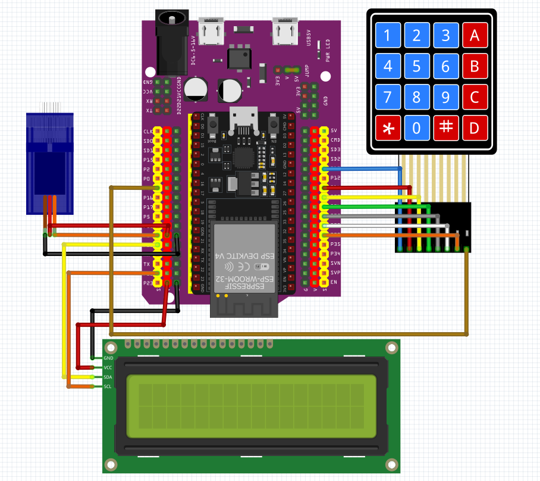

# ESP32 Smart Lock System

An ESP32-based smart lock system using:

- Bluetooth device authentication
- 4x4 keypad password input
- Serial Monitor password input
- I2C LCD display
- Servo motor door lock

## Features

- Unlock using authorized Bluetooth devices
- Unlock using keypad PIN
- Unlock using Serial Monitor input
- Auto-lock after timeout
- Reject unauthorized Bluetooth devices
- LCD status display

---

# Hardware Used

- ESP32
- 4x4 Matrix Keypad
- I2C LCD (16x2)
- Servo Motor
- Jumper Wires
- Power Supply

---

# Libraries Required

Install these libraries in Arduino IDE:

- `Keypad`
- `LiquidCrystal_I2C`
- `ESP32Servo`

`BluetoothSerial` is already included with ESP32 board package.

---

# Uploading the Code

1. Install ESP32 board package in Arduino IDE
2. Select your ESP32 board
3. Upload the code
4. Open Serial Monitor at:

```txt
115200 baud
```

---

# Bluetooth Device Authentication

The lock automatically unlocks when an authorized Bluetooth device connects.

Bluetooth name:

```txt
SmartLock_ESP32
```

## Adding Authorized Devices

Find your device MAC address and add it to:

```cpp
String authorizedMACs[NUM_DEVICES] = {
  "XX:XX:XX:XX:XX:XX"
};
```

Example:

```cpp
"C0:35:32:9E:B9:4E"
```

## Changing Maximum Number of Devices

Update:

```cpp
const int NUM_DEVICES = 4;
```

Make sure the number matches the amount of MAC addresses in the list.

---

# Keypad Input

## Default PIN

```txt
1234
```

## Controls

| Key | Function |
|---|---|
| `0-9` | Enter PIN |
| `*` | Clear input |
| `#` | Submit PIN |

---

# Serial Monitor Input

You can also enter the PIN using Arduino Serial Monitor.

Example:

```txt
1234#
```

The system reads serial input the same way as keypad input.

---

# Changing the Password

Edit this line:

```cpp
String correctPIN = "1234";
```

Example:

```cpp
String correctPIN = "5678";
```

---

# Servo Lock Positions

Modify servo angles here:

```cpp
lockServo.write(90); // Unlock
lockServo.write(0);  // Lock
```

Adjust depending on your lock mechanism.

---

# Auto Lock Duration

Default unlock duration:

```cpp
const unsigned long UNLOCK_DURATION = 5000;
```

Value is in milliseconds.

Example:

```cpp
10000 = 10 seconds
```

---

# Wiring Diagram

> Add wiring diagram image here later.

Suggested section:

```md
## Wiring Diagram


```

---

# Pin Configuration

| Component | ESP32 Pin |
|---|---|
| Servo Signal | GPIO 19 |
| Keypad Rows | 13, 14, 27, 26 |
| Keypad Columns | 25, 33, 32, 4 |
| I2C LCD SDA | Default ESP32 SDA |
| I2C LCD SCL | Default ESP32 SCL |

---

# Notes

- Unauthorized Bluetooth devices are rejected automatically
- Door auto-locks after timeout
- LCD displays system status in real-time

---

# License

Open-source project for educational and personal use.
